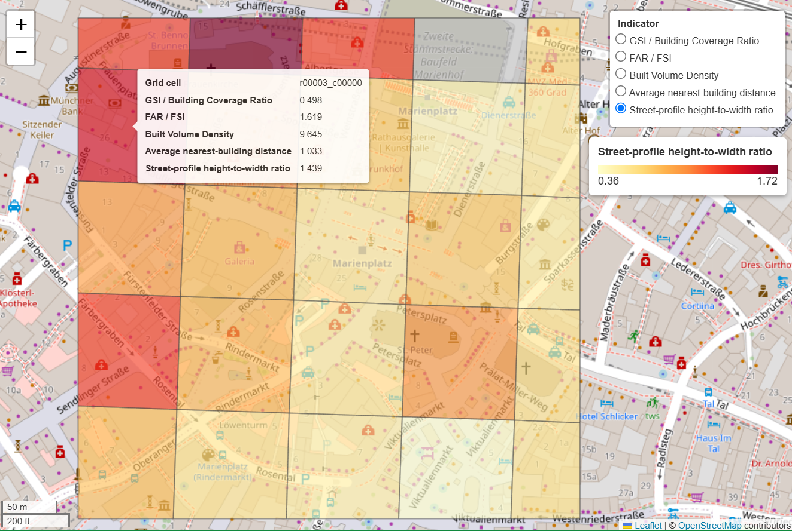

# Urban Density Workflow

**An integrated tool for exploring urban density and 3D urban morphology in cities worldwide.**

Urban Density Workflow is an open-source research tool for **urban planners, urban designers, and urban researchers** who want to quickly explore the physical structure of an urban area using reproducible geospatial indicators.

Given a user-defined area, the tool automatically acquires building data from **Overture Maps**, optionally enriches missing building heights with the **Global Building Atlas (GBA)**, uses **OpenStreetMap** for street context, and calculates indicators such as:

- **GSI / Building Coverage Ratio**
- **FAR / FSI**
- **Built Volume Density**
- **Average nearest-building distance**
- **Street-profile height-to-width ratio**

The workflow can be used through a local **Streamlit interface**, configuration files, or a **FastAPI REST service**. The FastAPI layer makes the same analytical workflow available programmatically and allows multiple users on a local network to submit long-running analyses asynchronously and retrieve results through analysis IDs.

> This is a research and exploratory planning tool. Results depend on the coverage and quality of the underlying data sources and should not be interpreted as authoritative planning or regulatory measurements.

## Munich example

The example below analyses a small area in central Munich using a 100 m grid and the `full_context` mode.



Example configuration:

```json
{
  "bbox": {
    "min_lon": 11.572,
    "min_lat": 48.135,
    "max_lon": 11.578,
    "max_lat": 48.139
  },
  "grid_size": 100,
  "mode": "full_context"
}
```

The generated interactive map can be opened directly in a browser after the analysis is completed.

---

## Contributors

**Agata Kiseleva · Dongsheng Chen***

The core indicator calculations, spatial workflow, data-quality checks, and scientific safeguards are based on Agata Kiseleva's ongoing Master's thesis at the Technical University of Munich:

**_An automated tool for measuring and analyzing global 3D building morphology_**

Original project repository:  
https://github.com/AgataKisel/urban-density-workflow

\* Dongsheng Chen contributed the FastAPI service layer and integration for asynchronous API access, testing, containerized execution, and CI-oriented deployment.

---

## Data and analysis workflow

The tool follows a single reusable scientific workflow:

```text
User-defined area
      ↓
Overture Maps Buildings
      ↓
Geometry cleaning + metric CRS
      ↓
Optional GBA height enrichment
      ↓
Regular analysis grid
      ↓
Density + morphology indicators
      ↓
Quality / readiness checks
      ↓
GeoPackage + JSON + GeoJSON + interactive map
```

For contextual analyses, OpenStreetMap data are accessed through OSMnx.

Three analysis modes are available:

- `quick_2d` — GSI only
- `standard` — GSI, FAR/FSI, and Built Volume Density
- `full_context` — standard indicators plus nearest-building distance and street-profile analysis

Coverage varies by city and data source. GBA height enrichment is optional and may not be available or practical for every study area.

---

# Quick start

## Option 1 — Docker

Build the image from the repository root:

```bash
docker build -t urban-density-api .
```

Run the service:

```bash
docker run -p 8000:8000 -v udw-analyses:/data/analyses urban-density-api
```

Open Swagger UI:

```text
http://localhost:8000/docs
```

If the host machine is reachable on your local network and the firewall allows port `8000`, other users on the same network can access the service using:

```text
http://<host-ip>:8000/docs
```

---

## Option 2 — Python

Python **3.11 or 3.12** is supported.

Create and activate a virtual environment, then install the API and test dependencies:

```bash
python -m pip install -e ".[api,test]"
```

Start the API locally:

```bash
python -m uvicorn api.main:app --app-dir 03_code --reload
```

For access from other devices on the same local network:

```bash
python -m uvicorn api.main:app --app-dir 03_code --host 0.0.0.0 --port 8000
```

Swagger UI:

```text
http://localhost:8000/docs
```

The original local Streamlit interface remains available:

```bash
python -m streamlit run 03_code/app.py
```

---

# Run an analysis through the REST API

Submit the Munich example:

```bash
curl -X POST http://localhost:8000/api/v1/analyses \
  -H "Content-Type: application/json" \
  -d '{
    "bbox": {
      "min_lon": 11.572,
      "min_lat": 48.135,
      "max_lon": 11.578,
      "max_lat": 48.139
    },
    "grid_size": 100,
    "mode": "full_context"
  }'
```

The service immediately returns an `analysis_id` while the geospatial workflow continues in the background.

Check progress:

```bash
curl http://localhost:8000/api/v1/analyses/<analysis_id>/status
```

Retrieve the summary:

```bash
curl http://localhost:8000/api/v1/analyses/<analysis_id>/results
```

Retrieve the grid as GeoJSON:

```bash
curl http://localhost:8000/api/v1/analyses/<analysis_id>/grid.geojson --output grid.geojson
```

Or open the interactive map directly in a browser:

```text
http://localhost:8000/api/v1/analyses/<analysis_id>/map
```

---

## Outputs

Each analysis stores its outputs locally, including processed spatial layers, indicator grids, quality/readiness reports, workflow metadata, and processing timings.

By default, API analyses are stored under:

```text
04_outputs/api/
```

Useful service settings:

```text
UDW_OUTPUT_DIR
UDW_MAX_WORKERS
```

The API uses lightweight in-process workers and local JSON job metadata. It is intended for **research, demonstration, and local-network use**, not horizontally scaled production deployment.

---

## License and attribution

The project is released under the **MIT License**. Existing authorship, citation metadata, data-provider attribution, and third-party notices remain applicable.

See:

- [ATTRIBUTION.md](./ATTRIBUTION.md)
- [THIRD_PARTY_NOTICES.md](./THIRD_PARTY_NOTICES.md)
- [CITATION.cff](./CITATION.md)
- [LICENSE](./LICENSE)

